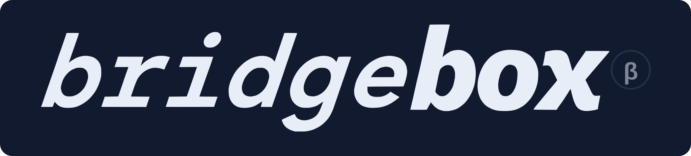
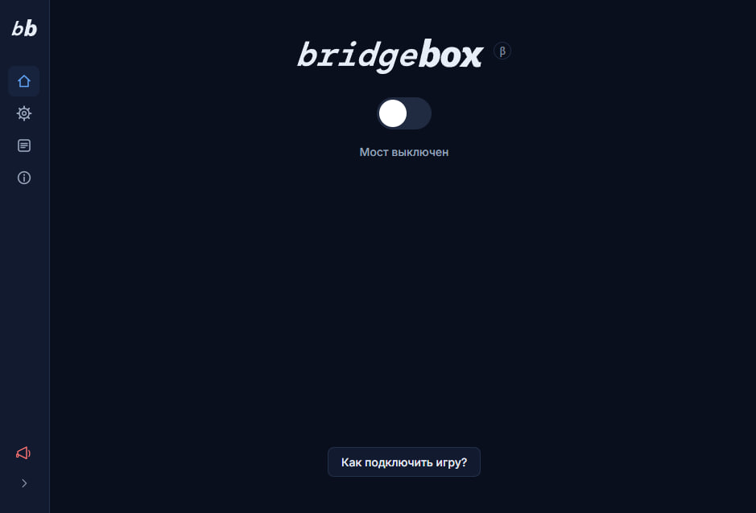
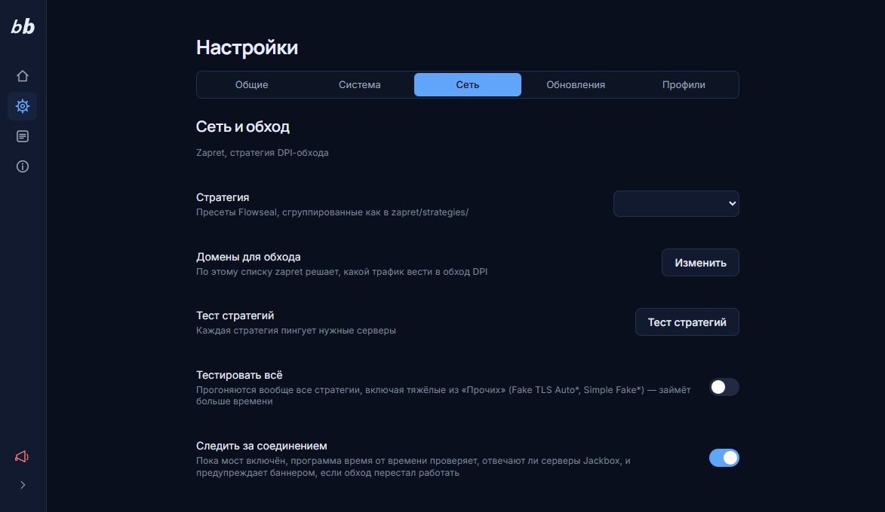
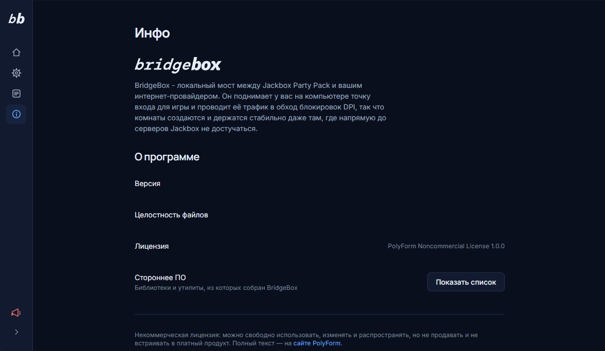

<div align="center">

[](README.en.md)



*Made with Claude Sonnet 5 / Opus 5 / GPT-5.6 Sol*

[](https://github.com/getonjbghelp/bridgebox/releases/latest)
[](LICENSE.md)
[](#скачать)
[](https://github.com/getonjbghelp/bridgebox/releases)
[](https://t.me/bridgeboxofficial)

</div>

BridgeBox поднимает локальный мост между Jackbox Party Pack и вашим интернет-провайдером
и проводит трафик игры в обход DPI-блокировок. Работает целиком на вашем компьютере,
не трогает систему сверх одного локального сертификата и не требует ни VPN, ни
арендованного сервера.

---

> [!CAUTION]
> ### Фейки
> Официальный Telegram-канал проекта - **[@bridgeboxofficial](https://t.me/bridgeboxofficial)**,
> других нет. Официальное место распространения программы - вкладка
> **[Releases](https://github.com/getonjbghelp/bridgebox/releases/latest)** этого репозитория.
> Всё остальное, что называет себя BridgeBox, - не мы.

> [!WARNING]
> ### Антивирусы и WinDivert
> Обход DPI работает через WinDivert - драйвер для перехвата и фильтрации трафика,
> тот же самый, что использует оригинальный [zapret](https://github.com/bol-van/zapret)
> и десятки других проектов. Легитимный инструмент, но часть антивирусов (включая
> Windows Defender) время от времени принимает его за потенциально нежелательное
> приложение и отправляет в карантин - детект называется примерно `WinDivert` или
> `Not-a-virus:RiskTool.Multi.WinDivert`.
>
> Если это случилось - добавьте папку BridgeBox в исключения антивируса или отключите
> детектирование PUA. Без файлов WinDivert обход не запустится, и программа честно
> скажет об этом в логах, а не просто "не заработает".

---

## Скриншоты

<table>
<tr>
<td align="center" width="33%"><br><sub>Запуск</sub></td>
<td align="center" width="33%"><br><sub>Настройки → Сеть и обход</sub></td>
<td align="center" width="33%"><br><sub>Инфо</sub></td>
</tr>
</table>

---

## Содержание

- [Скриншоты](#скриншоты)
- [Что это и зачем](#что-это-и-зачем)
- [Скачать](#скачать)
- [Как подключить игру](#как-подключить-игру)
- [Экраны программы](#экраны-программы)
- [Все настройки по пунктам](#все-настройки-по-пунктам)
- [Если не работает](#если-не-работает)
- [Как это устроено внутри](#как-это-устроено-внутри)
- [Чего BridgeBox пока не умеет](#чего-bridgebox-пока-не-умеет)
- [Для разработчиков](#для-разработчиков)
- [Где что лежит](#где-что-лежит)
- [Безопасность и приватность](#безопасность-и-приватность)
- [Поддержать проект](#поддержать-проект)
- [Лицензия](#лицензия)

---

## Что это и зачем

Игры Jackbox общаются со своими серверами по протоколам `Ecast` и `Blobcast`.
В некоторых странах это соединение работает нестабильно: комнаты создаются через раз,
игроки попадают в игру с большой задержкой, а иногда игра вообще не начинается.
Причина - DPI, глубокая инспекция трафика у провайдера. Неофициальные серверы эту
проблему тоже решают, но держатся на случайных VPS и падают вместе с ними.

BridgeBox решает её двумя частями, работающими вместе:

1. **Zapret** - обходит DPI на уровне сетевых пакетов. Это готовый движок
   (`winws.exe` от bol-van в сборке Flowseal), которым BridgeBox управляет:
   запускает, останавливает, переключает стратегии, тестирует их, умеет сам
   обновлять его файлы с GitHub.
2. **Мост** - локальный HTTPS-сервер по адресу `127.0.0.1:PORT`. Вы указываете
   его игре как адрес сервера, и весь её трафик проходит через него. Это даёт
   единую точку, где всё видно в логах и чем можно управлять.

Игры Jackbox говорят на **двух разных протоколах** в зависимости от игры:
Party Pack 7 и новее используют Ecast, более старые (Party Pack 1–6 и часть
отдельных игр) - Blobcast. Мост обслуживает **оба одновременно** - это не
переключатель режима, у каждого протокола просто свой адрес назначения,
настраиваемый отдельно (см. [«Профили подключения»](#все-настройки-по-пунктам)).

Ключевое отличие от неофициальных серверов: BridgeBox **не знает про конкретные
игры**. Он пересылает протокол целиком, а не отдельные заранее прописанные
запросы. Новый Party Pack поэтому не требует обновления программы.

---

## Скачать

Актуальная версия - всегда во вкладке **[Releases](https://github.com/getonjbghelp/bridgebox/releases/latest)**
этого репозитория, не в коде на вкладке Code (там - исходники для разработки, см.
[«Для разработчиков»](#для-разработчиков)).

1. Скачайте `BridgeBox_Portable.zip` из последнего релиза и распакуйте куда угодно -
   хоть на флешку. Ничего не устанавливается в систему: удалить программу значит
   просто удалить папку.
2. Запустите `bridgebox.exe`. Windows запросит права администратора - без них не
   получится ни поднять драйвер WinDivert, ни поставить локальный сертификат;
   откажете - программа честно объяснит это и закроется.
3. Первый запуск проведёт через мастер настройки: язык интерфейса, подбор
   стратегии обхода, которая реально работает у вашего провайдера, и решение
   о том, проверять ли обновления самого BridgeBox автоматически.

Каждая скачанная копия работает независимо: свои сертификаты, свои настройки, свои
логи. Ничего не пишется в реестр или `%APPDATA%`, поэтому можно держать несколько
версий рядом друг с другом или перенести рабочую копию на другой компьютер обычным
копированием папки.

---

## Как подключить игру

Кнопка **«Как подключить игру?»** на главном экране открывает пошаговую
инструкцию с вашим актуальным адресом и портом.
Сначала выбирается платформа: **Steam** или **прочие копии** (не через
Steam) - у них разный способ задать игре адрес сервера, дальше всё общее.

### Steam

Кнопка **«Вставить Автоматически»** вверху инструкции сама находит
установленные через Steam копии Jackbox и прописывает им параметр запуска -
ничего искать и редактировать руками не нужно. Чтобы применить изменения,
Steam будет закрыт и запущен заново (игры, открытые через него в этот
момент, остановятся); внесённое можно вернуть обратно оттуда же кнопкой
«Вернуть как было».

Если нужно вручную (или Steam почему-то не нашёлся сам):

1. В Steam нажмите правой кнопкой по игре Party Pack → **Свойства**.
2. Вкладка **Общие** → поле **Параметры запуска**.
3. Вставьте туда строку:

   ```
   -jbg.config serverUrl=127.0.0.1:PORT
   ```

   **Без `https://` в начале.** Игра подставляет протокол сама, и адрес со
   схемой она проигнорирует. Это проверено на практике.

   Если вы поменяли порт в настройках - подставьте свой.

4. Закройте свойства и запустите игру.

### Прочие копии (не через Steam)

Та же кнопка **«Вставить Автоматически»** здесь сканирует все локальные
диски: находит ярлыки Jackbox и файлы `jbg.config.jet` и предлагает
отметить, какие из них поправить. Правит только то, что уже существует -
ничего не создаёт с нуля, поэтому копия без единого ярлыка или файла
конфигурации в списке не появится. Полный обход всех дисков может занять
пару минут - счётчик проверенных папок покажет, что процесс идёт.

Если нужно вручную - два способа, в инструкции внутри программы к каждому
шагу приложена короткая анимация.

**Способ 1 - через ярлык (проще).** Создайте ярлык `.exe`-файла игры, откройте
его свойства → поле **Объект** → после закрывающей кавычки через пробел
допишите ту же строку `-jbg.config serverUrl=127.0.0.1:PORT`. Дальше игра
запускается через этот ярлык.

**Способ 2 - правка конфигурации игры (гибче).** В папке `games` внутри копии
игры найдите нужный Party Pack и в его `jbg.config.jet` замените значение
поля `serverUrl` на `127.0.0.1:PORT` (без схемы). Этот способ позволяет
выбрать, какая именно из установленных игр пойдёт через мост, не трогая
остальные.

### После подключения

Игра создаст комнату через мост. Код комнаты появится на экране как обычно.
Игроки заходят на **jackbox.fun / jackbox.ru / jackbox.tv / прочие** и вводят код - как всегда, ничего нового.

### Проверка, что всё работает

Когда мост включён, на главном экране появляется кнопка **"Проверить соединение
(ping)"**. Она:

- пингует активные серверы Ecast и Blobcast - официальные, либо ваш
  собственный сервер, если он указан в профиле подключения;
- создаёт через мост настоящую тестовую комнату;
- проверяет, что комната зарегистрировалась;
- удаляет её за собой.

Каждый шаг выводится отдельной строкой. Если что-то не так - увидите, на каком
именно этапе.

---

## Экраны программы

Панель слева сворачивается в узкую полосу с иконками (логотип при этом
складывается в монограмму «bb») - кнопка внизу панели, состояние запоминается
между запусками. При первом запуске мастер настройки сам проведёт через выбор
языка, подбор стратегии обхода и настройку автообновления самой программы,
дальше открывается обычное окно.

При первом запуске (или пока версия не вышла из статуса «бета») рядом с
логотипом виден значок **β** - подсказка при наведении объясняет, что это
значит, а клик открывает историю версий программы.

### Запуск

Главный экран. Большой переключатель, статус моста, адрес с кнопкой копирования,
кнопка проверки соединения и инструкция «Как подключить игру».

### Настройки

Пять разделов: **Общие**, **Система**, **Сеть**, **Обновления**, **Профили**.
Разобраны [ниже](#все-настройки-по-пунктам).

### Инфо

Логотип, короткое описание программы, текущая версия, статус целостности
файлов, лицензия программы, кнопка со списком стороннего ПО (имя, автор,
лицензия и ссылка на каждый проект - тот же список, что в
[CREDITS.md](CREDITS.md)) и кнопки-ссылки (соцсети, донат и т.п.) - у каждой
либо прямой переход по адресу, либо всплывающее окно с текстом. Кнопка-громкоговоритель
в боковой панели ведёт туда же, куда и вкладка «Инфо» - на GitHub Issues или в
форму обратной связи, чтобы сообщить о баге. Содержимое экрана «Инфо» - не
зашитый в код текст, а данные из `frontend/src/data/content/`, которые
разработчик правит через `tools/build_content.py`, не трогая исходники
руками. История версий (β-значок выше) берётся напрямую из GitHub Releases
проекта, а не хранится в репозитории.

### Логи

Живая лента того, что делает программа. Обновляется раз в секунду, пока экран
открыт.

- **Фильтр по уровню** - четыре кнопки: DEBUG, INFO, WARNING, ERROR. Нажатие
  включает и выключает показ соответствующих строк.
- **Поиск** - по тексту сообщения, имени модуля и функции.
- **Копировать** - кладёт в буфер обмена то, что сейчас видно с учётом фильтров.
- **Очистить** - убирает строки из окна (в файл они уже записаны).
- Лента сама прокручивается к новым записям. Если вы прокрутили вверх, чтобы
  что-то прочитать, автопрокрутка останавливается и появляется кнопка
  **«↓ Новые записи»**.

Логи параллельно пишутся в `logs/bridgebox.log` с ротацией по 20 МБ.

---

## Все настройки по пунктам

### Язык и вид

| Пункт | Что делает |
|---|---|
| **Язык** | «Как в системе» (определяется автоматически), русский или английский. Меняется сразу, без перезапуска - на все экраны, трей и страницы-заглушки в браузере. |
| **Тёмная тема** | Переключает светлую и тёмную темы. Сохраняется. Заголовок окна (та полоса с крестиком, что рисует сама Windows) перекрашивается вместе с интерфейсом - на Windows 11 полностью, на Windows 10 меняется только его светлота, цвет остаётся системным (из-за системных компромиссов). |
| **Анимации интерфейса** | Выключает все переходы и анимации. Полезно на слабых машинах. |

### Запуск и трей

| Пункт | Что делает |
|---|---|
| **Запускать вместе с Windows** | Создаёт задачу в Планировщике заданий с наивысшими правами и повышенным приоритетом (это не ключ автозапуска в реестре - без прав администратора обход всё равно не смог бы работать, а приоритет означает, что BridgeBox не ждёт своей очереди среди других программ автозапуска). Рядом - подпункт **«Запускать свёрнутым в трей»**, чтобы окно не появлялось при входе в систему. |
| **Сразу включать мост** | Мост поднимается сам при открытии программы, без нажатия тумблера. |
| **Сворачивать в трей при закрытии** | Крестик прячет окно в область уведомлений, а не выключает обход посреди игры. Полный выход - через пункт меню значка в трее. Значок в трее живой: подсказка при наведении и пункт «Остановить мост» всегда показывают актуальное состояние моста. |

### Система

| Пункт | Что делает |
|---|---|
| **Скрывать консоль** | По умолчанию включено - обход работает в фоне, без отдельного чёрного окна рядом с программой (действует и во время автоподбора стратегии в мастере настройки). Выключите, если хотите видеть вывод Zapret вживую. |
| **Порт** | Порт локального моста, по умолчанию 8443. Меняйте, если он занят. Применится при следующем запуске моста. Кнопка «Сбросить» вернёт 8443. |
| **Папка для временных файлов** | Куда скачивается и распаковывается обновление Zapret (см. ниже). |

### Сеть и обход

| Пункт | Что делает |
|---|---|
| **Стратегия** | Способ обхода DPI. По умолчанию 21 пресет, сгруппированы: «Основная», «Альтернативы», «Прочие». Разным провайдерам подходят разные - это нормально. |
| **Тест стратегий** | Перебирает стратегии одну за другой, пингуя активные серверы Ecast/Blobcast - официальные, либо ваш собственный сервер, если он указан в профиле подключения. Можно выбрать, что пинговать - Ecast, Blobcast или оба (тогда это два отдельных прохода по всем стратегиям, один за другим). Потом предлагает применить самую быструю и сохранить результаты в JSON или HTML. Занимает несколько минут, «Оба» - немного дольше. |
| **Тестировать всё** | Включает в перебор группу «Прочие» (Fake TLS Auto, Simple Fake). Их много и они медленные, поэтому по умолчанию пропускаются. |
| **Домены для обхода** | Список сайтов, к которым применяется обход. По одному имени в строке, строки с `#` - комментарии. Применится при следующем запуске моста. |
| **Следить за соединением** | Пока мост включён, программа время от времени незаметно проверяет, отвечают ли серверы Jackbox, и показывает баннер с подсказкой перезапустить тест стратегий, если несколько проверок подряд не прошли. Включено по умолчанию - применится при следующем запуске моста. |

**Про тест стратегий:** то, что часть стратегий не проходит - это результат, а
не ошибка. Вам нужна одна работающая.

### Обновление Zapret

Проверяет и подтягивает свежие `winws.exe`, WinDivert и `.bin`-файлы обхода
прямо с GitHub-релиза Flowseal. Заодно адаптирует стратегии из этого релиза
под формат BridgeBox: новые добавляются, уже знакомые обновляются на месте,
а те, что вы правили руками, никогда не перезаписываются - вместо этого рядом
появляется файл с пометкой «(updated)». Подробности - в
[`zapret/README.md`](zapret/README.md).

| Пункт | Что делает |
|---|---|
| **Установленная версия** | Версия из `zapret/ver.installed.txt`. |
| **Проверять при запуске** | По умолчанию выключено - GitHub из некоторых стран может быть недоступен. Включённая проверка идёт в фоне сразу после запуска и не задерживает открытие окна; результат появляется здесь же, как если бы вы сами нажали «Проверить обновления». |
| **Проверить обновления** | Разовый запрос к GitHub. Если есть новая версия - появится кнопка «Обновить». |
| **Обновить** | Скачивает архив релиза, распаковывает во временную папку, заменяет только реально используемые файлы. Спросит подтверждение; если мост запущен, обход на время замены остановится. |

После обновления программа предложит перезапуститься - новые файлы подхватятся
только после этого.

Это обновление касается только движка обхода. Обновление самого BridgeBox -
следующий раздел.

### Обновление BridgeBox

Отдельно от Zapret - программа проверяет [собственные релизы на
GitHub](https://github.com/getonjbghelp/bridgebox/releases/latest), показывает
список изменений и, если это собранная версия (не запуск из исходников), может
сама себя обновить без похода в браузер: скачивает архив релиза, сверяет его
контрольную сумму с той, что GitHub сам посчитал при публикации, и подменяет
запущенные `bridgebox.exe` и `_internal/` разом (второе - это код и интерфейс
программы, см. [«Собрать свой portable-релиз»](#собрать-свой-portable-релиз)).
Критическое обновление безопасности показывает отдельный красный баннер,
который не исчезает насовсем, пока не установлено.

| Пункт | Что делает |
|---|---|
| **Установленная версия** | Версия самого BridgeBox (не Zapret). |
| **Проверять при запуске** | По умолчанию **включено** - в отличие от проверки Zapret, это тот же канал, по которому приходят критические предупреждения безопасности. |
| **Проверить обновления** | Разовый запрос к GitHub. |
| **Обновить BridgeBox** | Скачивает, проверяет контрольную сумму и подменяет `bridgebox.exe` и `_internal/`. После успеха предложит перезапуститься - новая версия заработает только после этого. При запуске из исходников недоступно - обновляйтесь через `git pull`. |

### Профили подключения

Профиль - это адрес сервера плюс настройки, специфичные для его протокола.
**Ecast и Blobcast работают всегда одновременно** - это не переключатель:
у каждого протокола свой активный профиль, и оба применяются к своей части
трафика без вашего участия. «Тип протокола» у профиля определяет, какие
запросы на него пойдут и какие настройки к нему относятся.

Два официальных профиля (**Официальный Ecast**, **Официальный Blobcast**)
нельзя удалить, переименовать, сменить им адрес или тип - это гарантия, что
у протокола всегда есть куда слать трафик, даже если все свои профили удалены.

**Редактирование профиля и его использование - разные действия.** Профилей
одного типа может быть несколько (например, зеркало рядом с официальным
сервером), а работает всегда один. Выпадающий список выбирает, какой профиль
вы сейчас настраиваете; кнопка **«Сделать активным»** - какой из них реально
используется мостом.

| Пункт | Что делает |
|---|---|
| **Профиль** / **+** | Выбор редактируемого профиля; плюс создаёт новый (по умолчанию - копия официального Ecast). |
| **Тип протокола** | Ecast или Blobcast. У официальных профилей заблокирован. |
| **Название**, **Адрес сервера** | Только `https://`. У официальных профилей заблокированы. |
| **Активный профиль** / **Удалить** | Сделать используемым или удалить (кроме официальных). Применится при следующем запуске моста. |
| **Перенос профилей** | Экспорт/импорт своих профилей файлом или текстом. Импорт только добавляет - не трогает существующие профили и не меняет, какой из них активен. Официальные профили никогда не переносятся. |

**Настройки профиля Ecast** (переписывание ответов и объём проксирования):

| Пункт | Что делает |
|---|---|
| **Проксировать весь трафик** | **Включено по умолчанию.** Любой путь, не относящийся к Blobcast, уходит на адрес этого профиля. Выключите - пойдут только пути из списка ниже. |
| **Пути Ecast** | Список через запятую, каждый начинается с `/`. По умолчанию `/api, /tts, /media`. Учитывается, только когда «весь трафик» выключен. На Blobcast не влияет - у него свой список. |
| **Ключи для подмены** | Какие поля JSON с адресом сервера подменять на адрес моста. Выключено (по умолчанию) - ответ уходит игре без изменений. |
| **Ключи кода комнаты** | Где искать код комнаты. Ответ игре не меняет - нужен диагностике, поэтому без переключателя. |
| **Origin** | Подменять ли заголовок Origin. Выключено - уйдёт тот, что прислала игра. |
| **User-Agent** | Подставлять браузерный User-Agent, если игра не прислала свой. Без него API отвечает 403. |

Три переключателя переписывания **по умолчанию выключены** - прямое
соединение уже работает благодаря Zapret, и подмена нужна только для
экспериментов или нестандартного сервера.

**Настройки профиля Blobcast** (сессия Party Pack 1–6 идёт по отдельному
протоколу поверх socket.io, и мост её перехватывает на отдельном порту):

| Пункт | Что делает |
|---|---|
| **Перехватывать игровую сессию** | Включено по умолчанию. Выключите - сессия пойдёт напрямую к Jackbox мимо моста; комнаты всё равно создаются, просто мост её не увидит. Запасной выход на случай, если перехват где-то сломается. |
| **Имя для игры** | Голое имя хоста (без `https://` и без порта) - игра подставляет порт сама. Значение по умолчанию, `localhost`, менять не нужно без веской причины. |
| **Писать кадры сессии в лог** | Выключено по умолчанию - иначе лог быстро заполняется отладочными данными сессии. |
| **Пути Blobcast** | Какие запросы считаются относящимися к Blobcast, а не к Ecast. |
| **Порт socket.io** | Порт, на который игра открывает сессию, по умолчанию 38203. Этот же порт обязан быть в фильтрах стратегий Zapret - иначе обход DPI на нём не сработает. |

У кнопок сброса и удаления есть галочка **«Больше не спрашивать»** - своя для
каждой, отключение одной не отключает остальные.

### Сброс настроек

Отдельным разделом в самом низу экрана «Настройки» - единственное действие
здесь, которое разом касается всех остальных разделов, а не одного.

| Пункт | Что делает |
|---|---|
| **Сброс всех настроек** | Возвращает всю программу к заводским значениям - сеть, стратегию, профили подключения, тему. Спросит подтверждение. Список доменов при этом **не трогается**. |

---

## Если не работает

### Игра не создаёт комнату

1. Убедитесь, что мост **включён** - на главном экране горит «Мост активен».
2. Нажмите **«Проверить соединение (ping)»**. Смотрите, на каком шаге падает:
   - **пинг не проходит** → проблема в обходе DPI, идите к тесту стратегий;
   - **создание комнаты: ошибка сети** → мост не достучался до Jackbox;
   - **всё зелёное, а игра не работает** → проверьте, что параметр
     подключения действительно дошёл до игры (см.
     [«Как подключить игру»](#как-подключить-игру)).
3. Проверьте сам параметр: `-jbg.config serverUrl=127.0.0.1:8443`, **без
   `https://`**, порт совпадает с тем, что в программе.

### Работало, потом перестало

Провайдеры периодически меняют настройки DPI. Откройте **Настройки → Тест стратегий**,
дождитесь конца и примените самую быструю. Это самое частое решение.

### Zapret не запускается

В логах будет `zapret failed to start`. Проверьте:

- программа запущена **от администратора**;
- антивирус не удалил `zapret\winws.exe` или `WinDivert64.sys` (см.
  [предупреждение выше](#антивирусы-и-windivert));
- не запущена вторая копия zapret вручную или от прошлого сеанса BridgeBox -
  при остановке моста снимается только процесс, который запустила **эта**
  сессия программы, посторонний `winws.exe` не трогается.

### Порт занят

Смените порт в **Настройки → Система и внешний вид → Порт** и не забудьте поправить
параметр подключения тем же способом, каким его задавали (см.
[«Как подключить игру»](#как-подключить-игру)).

### Не работают сторонние сайты-зеркала

Зеркала (`jackbox.fun` и подобные) - сторонние сервисы, к BridgeBox отношения
не имеют, и **по умолчанию их доменов нет в списке обхода** - только настоящие
хосты Jackbox. Проблема может быть на стороне самого зеркала: он лежит, или не
может достучаться до сервера вашей комнаты, или официальные сервера выдают ему
таймауты - чинится это только там, не в BridgeBox. Играйте через **jackbox.tv**:
с работающим обходом он доступен напрямую и ничего делать не нужно.

### Ничего не помогло

Откройте **Логи**, включите все уровни, воспроизведите проблему, нажмите
**«Копировать»**. В логе токены и пароли автоматически замазываются, так что
его можно безопасно приложить к сообщению о проблеме. Дальше - через
громкоговоритель в боковой панели или экран «Инфо»: заведите issue на
[GitHub](https://github.com/getonjbghelp/bridgebox/issues) или напишите через
форму обратной связи, приложив логи.

---

## Как это устроено внутри

```
Игра (Steam или другая копия)
    │  serverUrl=127.0.0.1:PORT
    ▼
BridgeBox - локальный HTTPS-сервер
    │  Ecast (/api/v2/*) и Blobcast (/room, /accessToken, /socket.io)
    │  распознаются по пути и уходят каждый на свой профиль
    ▼
Zapret / WinDivert - обходит DPI на уровне пакетов
    │
    ▼
Настоящие серверы Jackbox
```

Что делает мост с каждым HTTP-запросом:

1. Принимает запрос от игры по HTTPS (со своим локальным сертификатом TLS - игра обращается именно по HTTPS).
2. Определяет по пути, Ecast это или Blobcast, и берёт адрес из
   соответствующего активного профиля.
3. Подменяет заголовок `Host` на адрес настоящего сервера - иначе тот не поймёт,
   какой сайт у него просят.
4. Пересылает запрос **целиком**: путь, параметры, заголовки и тело без
   изменений и без обрезки.
5. Получает ответ и отдаёт его игре, убрав служебные заголовки передачи.

**Мост не ограничивает размер запросов и ответов.** В логе строки обрезаются на
800 символах с пометкой `... (+N bytes)`, но это только запись в журнале - сами
данные проходят полностью.

Игровая сессия Blobcast (Party Pack 1–6) устроена отдельно: она идёт не по
HTTP, а по собственному протоколу поверх socket.io, на порту, который **выбирает
сама игра** (по умолчанию 38203). Мост поднимает под него отдельный
слушатель и ретранслирует кадры сессии дословно в обе стороны; это то, что
отключает настройка «Перехватывать игровую сессию» в профиле Blobcast.

Отдельные части:

- **Локальный сертификат.** При первом запуске создаётся свой центр сертификации
  и сертификат на `localhost`, который ставится в доверенные корневые. Без него
  игра отказалась бы соединяться с мостом по HTTPS - на нём же держится и
  перехват сессии Blobcast. Он не выходит за пределы вашего компьютера: подписывает
  только `localhost`, закрытый ключ ограничен правами текущего пользователя и
  администраторов (подробнее - в разделе [Безопасность](#безопасность-и-приватность)).
- **Заглушка для браузера.** Если открыть `https://127.0.0.1:PORT` в браузере,
  покажется предупреждение. Игра его никогда не увидит - оно отдаётся только
  тому, кто просит HTML.
- **WebSocket-релей для Ecast.** Есть в коде, но при выключенном переписывании
  ответов не используется: игра соединяется с сервером напрямую. Не путать с
  перехватом сессии Blobcast выше - это два независимых механизма.

---

## Чего BridgeBox пока не умеет

- **Не подписан цифровой подписью.** На первом запуске Windows SmartScreen
  может показать «Windows защитила ваш компьютер». Это стандартная реакция на
  любой новый exe без сертификата подписи кода, а не признак того, что что-то
  не так - нажмите «Подробнее» → «Выполнить в любом случае».
- **Только Windows 10/11.** WinDivert - драйвер только под Windows, а
  интерфейс держится на WebView2, которого нет ни на других системах, ни на
  Windows 7/8/8.1.

---

## Для разработчиков

Собрать и менять код можно без обращения к Releases - всё нужное лежит в этом
репозитории.

### Что нужно

| Требование | Зачем |
|---|---|
| **Windows 10/11 (64-bit)** | WinDivert - драйвер только под Windows; интерфейс - WebView2, который Microsoft больше не ставит на Windows 7/8/8.1 |
| **Права администратора** | Zapret грузит драйвер в ядро; сертификат TLS ставится в системное хранилище |
| **Python 3.11+** | Бэкенд программы |
| **Node.js 18+** | Сборка интерфейса (нужен только для сборки, не для каждого запуска) |

### Запуск из исходников

1. Запустите **`run.bat`** двойным кликом.
2. Появится запрос UAC - согласитесь. Без прав администратора программа не
   запустится (она честно об этом скажет и закроется).
3. При **первом** запуске приложение само создаст виртуальное окружение Python,
   поставит зависимости и соберёт интерфейс. Это займёт пару минут.
4. Дальше запуск быстрый: зависимости переустанавливаются, только если
   менялся `backend/pyproject.toml`, а интерфейс пересобирается сам, только
   если после последней сборки менялись файлы в `frontend/src` (в том числе
   тексты и содержимое страницы «Инфо» - правки через `tools/edit_ui_strings.py`
   и `tools/build_content.py` тоже подхватываются на следующем запуске без
   лишних вопросов). Флаг `--rebuild` пересобирает принудительно в любом
   случае.
5. Откроется окно BridgeBox, дальше - как с обычной версией.

Другие флаги `run.bat` (не в Portable): `--console` - показать консольное окно с выводом
(для отладки), `--dev` - взять интерфейс с dev-сервера Vite вместо сборки,
`--minimized` - стартовать сразу свёрнутым в трей (им пользуется задача
автозапуска).

### Собрать свой portable-релиз

```
python tools/build_portable.py
```

Собирает `dist/BridgeBox_Portable/` тем же способом, каким собираются файлы
на вкладке Releases: чистый `frontend/dist`, `bridgebox.exe` + `_internal/`
через PyInstaller (папка `onedir`, не один файл - распаковывается один раз при
сборке, а не заново при каждом запуске программы; без консольного окна, с
запросом прав администратора через встроенный манифест, с версией, вшитой
прямо из `backend/pyproject.toml`), а рядом - актуальный `zapret/`, пустые
`certs/`/`temp/`/`logs/` и чистый `config.yaml`. В конце скрипт сам проверяет
результат: что все нужные файлы на месте, что в exe и `_internal/` не
затесался путь со сборочной машины, и что манифест целостности (экран «Инфо»
→ статус целостности файлов) сходится с тем, что реально лежит в папке.

Флаг `--icon путь\к\файлу.ico` подставляет свою иконку вместо генерируемой по
умолчанию. Флаг `--skip-frontend-build` не поддерживается этим скриптом -
интерфейс пересобирается заново при каждом запуске.

---

## Где что лежит

```
BridgeBoxDevVersion/
  run.bat                        запуск из исходников (сам просит права администратора)
  config.yaml                    все настройки, можно править вручную
  CREDITS.md                     использованные проекты и лицензии
  LICENSE.md                     лицензия BridgeBox
  certs/                         локальный сертификат (создаётся сам)
  logs/bridgebox.log             журнал работы, ротация по 20 МБ
  backend/                       серверная часть на Python
    bridgebox/                   весь код бэкенда
    tests/                       автоматические проверки
  frontend/                      интерфейс на React
    src/screens/                 экраны: Запуск, Настройки, Логи, Инфо, мастер
    src/components/              переиспользуемые кнопки, тумблеры и т.п.
    src/data/strings/ru.json,    тексты интерфейса на двух языках
              en.json
    src/data/content/            содержимое экрана «Инфо» (история версий - с GitHub Releases)
      about.json, legacyChangelog.json
  zapret/                        движок обхода DPI
    strategies/                  стратегии (адаптированные под BridgeBox)
    lists/list-jackbox.txt       список доменов для обхода
  tools/
    edit_ui_strings.py           редактор текстов интерфейса (RU/EN рядом)
    build_content.py             редактор страницы «Инфо» (about.json, people.json)
    build_portable.py            сборка portable-релиза (то же, что публикуется в Releases)
```

`config.yaml` создаётся при первом сохранении настроек. Всё, что есть в
интерфейсе, лежит там же - можно править текстом, программа проверит значения
при загрузке и откажется от заведомо опасных.

Правка текстов интерфейса или содержимого «Инфо» через `tools/` не требует
пересборки вручную - `run.bat` сам замечает, что исходники новее собранного
интерфейса, и пересобирает его на следующем запуске.

---

## Безопасность и приватность

- **Права администратора** нужны для двух вещей: Zapret грузит драйвер
  WinDivert в ядро, и сертификат ставится в системное хранилище. Больше ни для
  чего.
- **Мост слушает только `127.0.0.1`**, на двух портах: основном (по умолчанию
  8443) и служебном для сессии Blobcast (по умолчанию 38203, поднимается
  только пока перехват включён). Из локальной сети и из интернета оба
  недоступны - подключиться может только программа с этого же компьютера.
- **Сертификат** создаётся локально и подписывает `localhost`. Закрытый ключ
  ограничивается правами доступа для текущего пользователя, SYSTEM и
  администраторов. Им же терминируется TLS сессии Blobcast.
- **В логах замазываются** токены, пароли и идентификаторы пользователя - как в
  файле, так и в окне логов. Заголовки авторизации скрываются целиком.
- **Никакой телеметрии.** Программа никуда не отправляет данные о вас; весь
  исходящий трафик - это запросы вашей игры к серверам Jackbox.
- **Куда идёт трафик**, задаётся адресом активного профиля в «Профилях
  подключения» и принимает только `https://` - это защита от подмены адреса
  на чужой сервер.
- **Импорт профилей** - недоверенный ввод: чужой файл может только *добавить*
  свои профили, никогда не перезаписывает существующие, не меняет активный
  выбор и не может подменить официальный сервер (официальные профили
  импортом игнорируются). Подробности - `backend/bridgebox/profiles_io.py`.
- **Portable-сборка ничего не пишет вне своей папки.** Ни `%APPDATA%`, ни
  реестр (кроме опциональной задачи автозапуска в Планировщике, если вы её
  включили сами) - см. [«Скачать»](#скачать).
- **Самообновление проверяет, что распаковывает.** Файлы из архива новой
  версии могут попасть только внутрь предназначенной для них папки - архив,
  который попытался бы записать что-то за её пределами, отклоняется целиком.

---

## Поддержать проект

BridgeBox бесплатный и таким останется - лицензия прямо запрещает продавать
его или встраивать в платный продукт. Если хочется поддержать разработку
деньгами, есть три способа (те же ссылки - на экране «Инфо» самой программы):

- **[Donatty](https://donatty.com/bridgebox)** - для России.
- **USDT**: `ERC20` `0xda7a456c3a48d1b607fc17b8c085c049a7221693`, `TRC20`
  `TLWSMZqmsak8xnr9qTgQVmRiWCzE6mQGY4`.
- **Bitcoin**: `18qBmbhKyDNrrrwsMcyq2niZ8dKK9MEJuL`.

Донатеры, багхантеры и тестеры, отметившиеся в проекте, попадают в раздел
«Благодарности» на экране «Инфо» - там же видно, кто что нашёл или проверил.

---

## Лицензия

BridgeBox распространяется по [PolyForm Noncommercial 1.0.0](LICENSE.md):
можно свободно использовать, изменять и делиться, нельзя продавать или
встраивать в платный продукт.

Сторонние компоненты лицензированы отдельно - полный список с авторами и
ссылками в [CREDITS.md](CREDITS.md) и на экране «Инфо» самой программы (кнопка
«Показать список» рядом со строкой лицензии). Ключевые: **zapret** (bol-van),
сборка **zapret-discord-youtube** (Flowseal), **WinDivert** (basil00),
**aiohttp**, **pywebview**, **React**, шрифты **Inter**, **Manrope** и
**JetBrains Mono** под SIL OFL 1.1.
